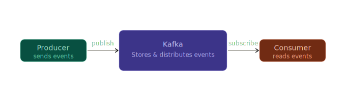
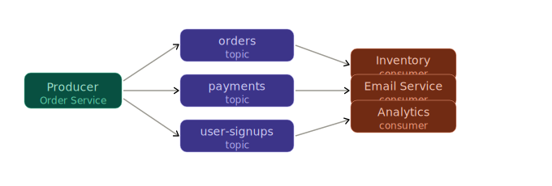
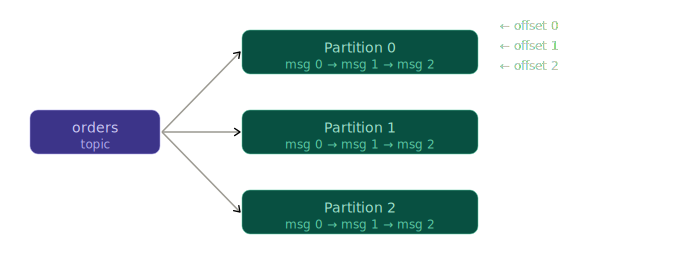

Imagine you're a child running messages between your mum and dad.

One message, one trip — no problem. But what happens when your mum has fifty things to say, your dad is busy with something else, and three other kids also need messages delivered? Chaos. Dropped messages. Waiting. Confusion.

That's the real problem in distributed systems. Services need to talk to each other — and doing it directly breaks down embarrassingly fast.

Apache Kafka fixes this. Not by making the running faster, but by introducing a post office in the middle.

---

## The Problem: Talking Directly Is Fragile

Before Kafka, services called each other directly. Service A sends a message to Service B. Simple.

Until B is down. Or slow. Or three more services also need the same data. Now A has to call all of them. You've wired everything together so tightly that one slow service can cascade into a full outage.

This is **tight coupling** — and it's the enemy of scale.

---

## Kafka as a Central Pipeline

Kafka sits in the middle. Producers drop events into it. Consumers read from it. Nobody talks to each other directly.

The producer doesn't care who reads its events. The consumer doesn't care who produced them. Kafka decouples them completely — in time, in speed, and in scale.

---

## Topics: Named Channels for Events

Every event goes into a **topic** — a named, logical channel. Think of it as a folder: `orders`, `payments`, `user-signups`.

Producers write to a topic. Multiple consumers can read from the same topic independently.

Notice: the Order Service doesn't know or care that three different consumers are reading its events. You can add a fourth consumer tomorrow without touching a single line in the producer.

## Partitions: Splitting the Lane for Speed

A topic alone isn't enough for massive scale. Kafka splits each topic into **partitions** — parallel lanes that can be processed simultaneously.

Think of a motorway with one lane versus six. Same road, far more throughput.

Key rules of partitions:

- Messages within a partition are **strictly ordered**
- Ordering is only guaranteed *within* a partition, not across all partitions
- More partitions = more parallelism = more throughput
- Kafka distributes partitions across multiple **brokers** (servers) for resilience

Each message gets an **offset** — a sequential number within its partition. Consumers track their own offset. This means a slow consumer doesn't block a fast one. It also means a consumer can *replay* events by rewinding its offset — a powerful property most messaging systems don't offer.

---

## Consumer Groups: Sharing the Work

A single consumer reading millions of events sequentially won't keep up. So Kafka lets you form a **consumer group** — multiple consumers sharing the load by each owning a subset of partitions.

Two critical things to internalise:

**Within a consumer group**, each partition is owned by exactly one consumer. So Group A splits the work — A1 handles partition 0, A2 handles partitions 1 and 2. Scale up consumers and Kafka rebalances automatically. But you can never have more parallel consumers than partitions — a common gotcha.

**Across consumer groups**, each group reads independently. Group A (your inventory service) and Group B (your analytics pipeline) both consume the same `orders` topic without interfering with each other. Kafka doesn't delete messages when one group reads them — both groups maintain their own offsets.

---

## Why Kafka Is Fast

Kafka's performance comes from a few deliberate design choices:

**Append-only writes.** Kafka never modifies existing messages — it only appends to the end of a partition log. Sequential disk writes are orders of magnitude faster than random ones.

**Zero-copy reads.** Kafka uses OS-level `sendfile()` to transfer data directly from disk to the network socket, bypassing the application layer entirely.

**Batching.** Producers and consumers both work in batches. Instead of sending one message at a time over the network, they group thousands of messages together. Fewer round trips, far higher throughput.

**Horizontal scaling.** More load? Add partitions. Add brokers. Kafka distributes the work automatically. This is the same principle behind every horizontally-scaled distributed system — no single node becomes the bottleneck.

---

## How Kafka Keeps Messages Safe

Kafka replicates each partition across multiple brokers. One broker is the **leader** for a partition — it handles all reads and writes. The others are **followers** that replicate the data.

If the leader goes down, a follower is automatically elected as the new leader. No messages are lost. No manual intervention required.

Combined with the append-only log and configurable **retention** (keep messages for 7 days, 30 days, or forever), Kafka gives you:

- **Durability** — messages survive broker failures
- **Replayability** — rewind to any offset and replay the past
- **Auditability** — a complete, ordered history of every event

This is why Kafka is described as an **event streaming platform**, not just a message queue. The log *is* the source of truth.

---

## The Mental Model That Makes It Click

> Kafka is a **central, durable, append-only log** of events. Producers write to it. Consumers read from it at their own pace. Nobody talks to anyone else directly.

Topics are named channels. Partitions are parallel lanes within a topic. Consumer groups share the work across those lanes. Offsets let each consumer track its own position independently.

Once that model is solid, everything else — replication, compaction, stream processing with Kafka Streams — is just detail layered on top.

---
